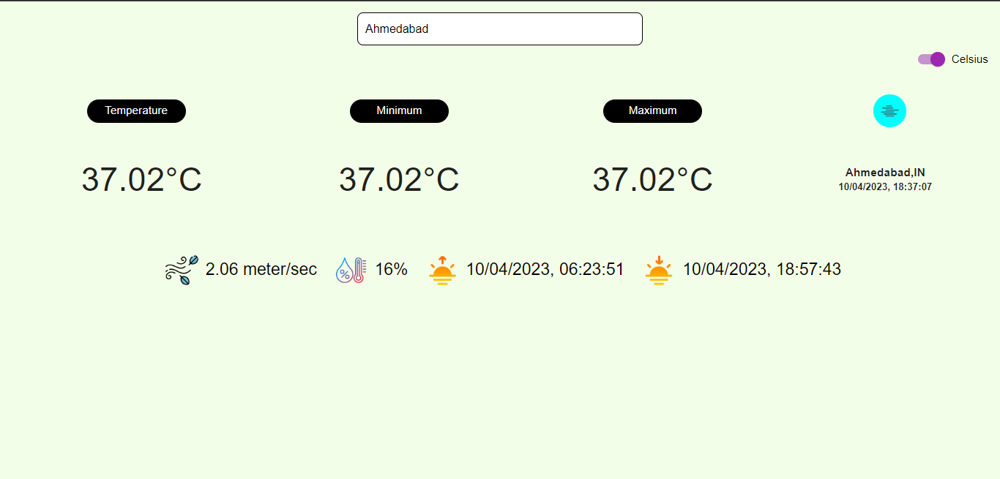

## React Weather app

## Overview
  - This is a simple Weather Application that helps you to know current weather of your area.

## Features
  - Check by city name or pincode.
  - Check cureent, minimum and maximumn temperature.
  - Check wind speed and humidity.
  - Check sunrise and sunset time.
  - Change temperature as per your mind, like Celsius to Fahrenheit and Fahrenheit to Celsius.

## Technologies Used
  - React
  - Material ui
          - For API, We use openweathermap website.

## Getting Started
  - Clone the repository: <code>git clone git@github.com:systemintegration/react-weather.git</code>
  - Install dependencies: <code>npm install</code>
  - Start the development server: <code>npm start</code>

## Contributing
  - Contributions are welcome! To contribute to the project, follow these steps:
    - Fork the repository
    - Create a new branch: <code>git checkout -b my-feature-branch</code>
    - Make your changes and commit them: <code>git commit -am 'Add some feature'</code>
    - Push your changes to your branch: <code>git push origin my-feature-branch</code>
    - Create a new pull request and explain your changes
In the project directory, you can run:

## Screenshots

## Demo
   - You can try out the application at <a href="https://systemintegration.github.io/react-weather">https://systemintegration.github.io/react-weather</a>
